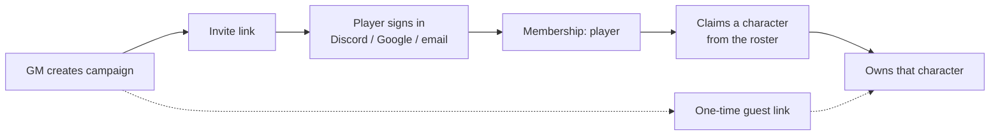
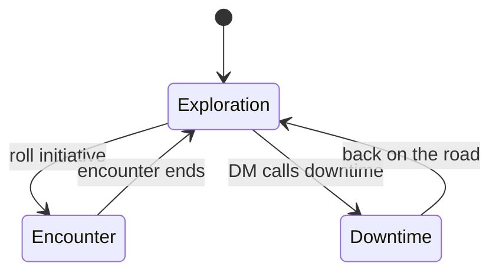
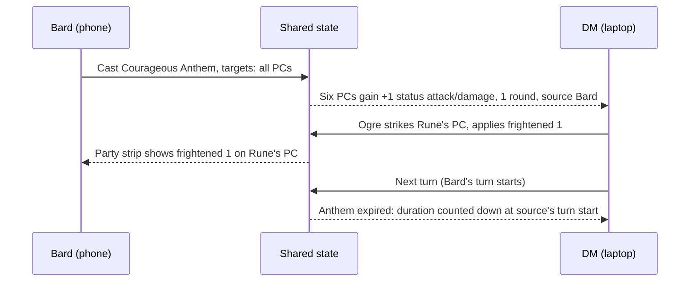
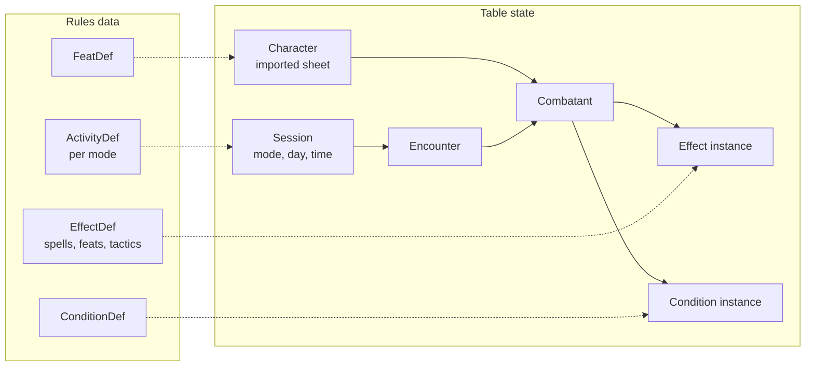
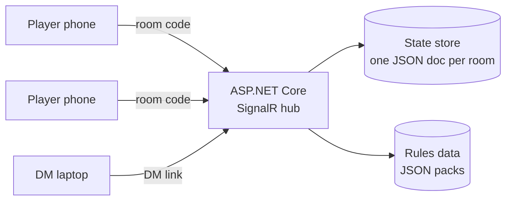

# PF2e Table Companion — design document

2026-09-18

## Problem and purpose

The tool's job is to put the rule on the table so nobody has to remember it or argue about it. Six players and a DM who wants the full picture means combat drowns in questions ("what's your AC?", "what does sickened do?", "is that buff still up?"), and outside combat, what a character is allowed to attempt gets decided by memory instead of by the character sheet.

Three concrete failures today:

- Numbers live in six heads. AC, saves and Perception are asked across the table every round; a +1 status bonus from a song is forgotten two turns later.
- Conditions are fuzzy. Fatigued, sickened, frightened and off-guard all sound similar and nobody is sure what stacks.
- Permission is adjudicated from memory. A player says "I try to read the document, that's a Society check"; the DM says no. The feat or skill action that settles it is on a sheet nobody has open.

The companion fixes this by holding the rules as data and computing the answer: every number the table needs is on screen, every condition and buff shows what it does right now, and every activity a character can attempt in the current mode of play is listed with the requirement that makes it legal. The DM keeps the full view; players see what their characters would know.

Scope: Pathfinder 2e Remaster (Player Core, Player Core 2, GM Core). Legacy names such as flat-footed are not used.

## Design principles

Every later decision in this document is checked against these six rules.

1. Rules live in data, not in heads. A condition, a buff or an activity is a structured record with its modifiers, duration and requirement, so the app can compute rather than describe. If it can't be computed, it is shown as rule text, never left out.
2. One truth, two audiences. The DM and the players read the same state. The DM sees all of it; a player sees their own character fully, the party's public numbers, and only what they would know about monsters.
3. The mode of play decides the screen. Encounter, Exploration and Downtime are first-class states of the app, and each shows the actions and activities that belong to it.
4. Everything a character can do comes from their sheet. Actions, spells and feats are listed per character from imported data, not from a generic menu. "You can do this because of feat X" is the answer to every dispute.
5. The app puts the rule on the table; it does not adjudicate. The DM still rules. The tool's job is that the ruling takes ten seconds and everyone can see what it was based on.
6. Built for a phone in one hand during play. Big tap targets, the current turn always visible, nothing more than two taps away. Correct-but-slow loses to the DM's memory.

A corollary of rule 1: wrong rules data is worse than none. Every rule record carries a source reference (book and section) and is editable at the table, and anything encoded from memory rather than from the book is flagged as unverified until checked.

## Roles and views

Two roles, one shared state: the DM edits everything, a player edits their own character and reads the rest. Monster details are not merely hidden in the UI; in the shared version they are stored where a player's client cannot read them at all.

| What | DM | Player (own character) | Player (other PCs) | Player (monsters) |
| --- | --- | --- | --- | --- |
| Name, initiative, turn marker | edit | edit initiative | read | read, unless the monster is marked unrevealed |
| HP, temp HP | edit | edit | read | not visible |
| AC, Fort, Ref, Will, Perception | edit | edit base, computed shown | read | not visible |
| Conditions (with value and rounds) | edit | edit | read | read |
| Buffs and debuffs (typed modifiers) | edit, apply to any target | apply to self and party | read | read |
| Spells, feats, actions from the sheet | read all sheets | read own, full text | read names only | read what the monster has shown |
| DM notes, monster statblock | edit | not visible | not visible | not visible |
| Mode of play, round, next turn | edit | read | read | read |

Design choices behind the table:

- Players apply their own buffs. When the bard plays a song, the bard taps the party, not the DM. The DM sees it land live and can undo it. This is what removes the "who tracks the +1?" problem.
- The DM can hand a monster's public row to the players (name and conditions) while keeping HP and stats private. An unrevealed monster does not exist on the player screen until the DM reveals it.
- Players see full spell and feat text only for their own character. The DM opens any character's sheet from the tracker instead of walking around the table.
- The DM view is bound to the DM's account, not to a toggle (see Identity and authorization). In a single-device version the same page has a DM/player toggle and the split is by honour, which is fine when the player view is a screen everyone can see.

## Identity and authorization

Roles are enforced on the server against an account, never in the UI. A player's client is never sent a monster's HP, so "don't peek" is not a rule anyone has to keep.

Three concepts, kept separate:

- Authentication: who this person is. An account, signed in once on their phone and remembered.
- Membership: which campaign they belong to and with what role (GM, player, guest).
- Ownership: which characters they may edit. A player owns one or more characters; the GM owns every monster.

### Policy table

Every read and write resolves against this. "Own" means a character the account owns in this campaign.

| Resource | GM | Player (own) | Player (other) | Guest |
| --- | --- | --- | --- | --- |
| Character sheet, full | read, write | read, write | read public block | read public block |
| Current HP, conditions, effects on own character | write | write | read | read |
| Apply an effect to another PC | write | write | read | read |
| Apply a condition to a monster | write | propose | propose | none |
| Monster HP, AC, saves, abilities | read, write | only what is revealed | only what is revealed | only what is revealed |
| Encounter order, round, mode | write | read | read | read |
| Rules data, house rules | write | read | read | read |
| Campaign membership, invites | write | none | none | none |

### Sign-in

Discord and Google as external providers, plus an email magic link as the fallback. A gaming group already has Discord; nobody wants to invent a password for a combat tracker.

For guests and for the player whose phone died, the GM can issue a one-time join link: a bearer token tied to one character, valid for one session, no account needed. It grants exactly that character's player rights.

### Flow



The GM creates the campaign and the character roster; a player claims a character rather than creating one, so the GM stays in control of who is in the party.

### Enforcement

- One authoritative state on the server. Each connection receives a projection of it computed for that account's role and ownership; unrevealed monsters and private fields are removed before the message is sent.
- Two broadcast channels per campaign: a public one everyone joins, and a GM channel. A change recomputes both projections and sends each to its channel.
- Writes are authorized per resource, not per screen: "may this account edit this character" is asked of the state, so a crafted request from a player's browser is refused the same way a UI button would have been.
- Policy-based authorization in ASP.NET Core fits this directly: requirements for CampaignMember, CampaignGm and CharacterOwner, with resource-based checks on the character or combatant being changed.
- Accounts hold an identifier, a display name and campaign memberships. No real names, no email beyond the login address, nothing that makes this a data-protection problem.

## Modes of play and screens

The app has one persistent party roster and three modes that follow the game's own structure; a Reference tab sits beside them. Switching mode is a DM action and every screen follows.



Exploration is the resting state; Encounter is entered by rolling initiative and returns to Exploration when the DM ends it. Downtime is entered deliberately and tracked in days.

### Navigation shell

```
[ Encounter | Exploration | Downtime | Sheet | Bestiary* | Reference ]   Round 3   Zuz ▾
 ─────────────────────────────────────────────────────────────────────────────────────
  party strip: six PC chips, each with HP bar and active conditions
 ─────────────────────────────────────────────────────────────────────────────────────
  mode screen (below)                                      * GM only
```

The party strip is always present so a player's own state is one glance away in any mode. The account name sits top right; Bestiary appears only for the GM, and not because the tab is hidden but because the data behind it is never sent.

### Encounter (combat tracker)

DM screen:

```
 Initiative                        Selected: Zuz (bard, L5)
 ▶ 23  Ogre boss     HP 48/60      AC 21  Fort +9  Ref +12  Will +11  Per +10
   21  Zuz           HP 37/37          (AC base 20, +1 circ Shield)
   19  Ogre 2        HP 60/60      Conditions: none
   17  Rune's PC     HP 44/52      Effects:  Courageous Anthem +1 status att/dmg, 1 rd
   12  ...                                    Raise a Shield +2 circ AC, until start of your next turn
 [ Next turn ]  [ Undo ]                Spells (from sheet) ▸  Feats ▸  Notes ▸
```

What it does:

- Initiative order with the current turn pinned to the top of the viewport; ties put adversaries before PCs (Player Core initiative rule).
- HP with damage/heal input and temp HP; a monster's HP is DM-only.
- Stat line per combatant: AC, Fortitude, Reflex, Will, Perception, computed from base plus every active modifier. A modified number shows its delta and, on tap, the breakdown by source.
- Conditions as chips with value and remaining rounds. Tapping a chip shows what the condition does in this ruleset and its mechanical effect as applied.
- Buffs and debuffs as typed modifier effects with a source and a duration, applied to one or many targets at once ("all PCs", "all monsters").
- Next turn advances the marker, counts durations down by the ruleset's timing, expires effects, decrements frightened at end of turn, and reminds about persistent damage. Undo reverts the last change.
- Character sheet drawer: the DM opens a PC's spells and feats with full text without leaving the tracker.

Player screen: the same order with monster HP and stats removed, unrevealed monsters absent, the player's own character expanded with their available actions, and buff/condition controls for their own character.

### Exploration

The screen answers two questions: what is each character doing right now, and what could they attempt.

- Exploration activity per character (Avoid Notice, Defend, Detect Magic, Follow the Expert, Hustle, Investigate, Repeat a Spell, Scout, Search, plus skill activities such as Track and Cover Tracks). The choice has a stated consequence the app carries forward, e.g. Scout grants the party +1 circumstance to initiative, Defend starts combat with the shield raised, Avoid Notice rolls Stealth for initiative.
- "What can I attempt" list per character, computed from the sheet: every exploration skill action with its requirement met or not met (trained in Society for Decipher Writing, a healer's toolkit for Treat Wounds) and the feats on the sheet that change it. The DM sees the same list for every character.
- Rest and camp panel: the 10-minute activities (Treat Wounds with its one-hour immunity per target, Refocus, Repair, Identify Magic) and the 8-hour rest with what it restores. The panel tallies time so "how long have we been here?" has an answer.

### Downtime

A day counter and one activity per character per day: Earn Income, Craft, Retrain, Subsist, Treat Disease, Create Forgery, Learn a Spell. Each shows its DC by task level and the outcome per proficiency rank so the DM does not open the table. This is the last phase to build and the least urgent.

### Reference

All conditions, all basic and skill actions, and the party's own spells and feats, searchable, in the same structured form the engine uses. This is where a dispute is settled when the answer is not already on screen.

## Character sheet in the module

The sheet lives in the app rather than beside it, so the tracker and the sheet never disagree. It is the same screen for the player who owns it and for the GM who opens it from the tracker; only the edit rights differ.

Two layers on one screen. The build layer comes from the import and changes at level-up: attributes, proficiencies, feats, spells known, items. The session layer changes constantly and lives in table state: current HP, conditions, effects, spell slots spent, focus points, hero points, and the current exploration activity.

### Layout

```
 Zuz · bard 5 · elf · HP 37/37 · AC 20 · Hero points ●●○
 ────────────────────────────────────────────────────────
 Defenses    AC 20   Fort +9   Ref +12   Will +11   Per +10
             active: +1 status (Courageous Anthem) ▸
 Strikes     rapier +13, 1d6+3 P   ·   MAP −5 / −10
 Skills      Acrobatics +12 (E) · Occultism +11 (T) · ...
 Spells      1st ●●○  2nd ●●○  3rd ●●○   Focus ●○
 Feats       ancestry · class · skill · general · archetype
 Items · Languages · Notes
```

- Every number shows its breakdown on tap: base, proficiency, attribute, item, and each active effect by name.
- Spells and feats open their full text. This is what lets the GM answer "what does that do?" without leaving his seat.
- Tapping a spell that grants an effect offers to apply it, with targets. That is the same path as the Courageous Anthem walkthrough.
- Spell slots, focus points and hero points are spent from the sheet and visible in the party strip.
- Any computed value can be overridden manually by its owner, with the reason recorded. The app will be wrong sometimes and the session should not stop for it.

### Archetypes and character options

Archetypes are a first-class part of the build layer, not an afterthought. A character can carry several, and their feats grant activities the requirement checker must know about.

- An archetype is a dedication feat plus the feats it unlocks. The standard rule is that two more feats from an archetype are required before taking another dedication; the app records archetypes, it does not police the build.
- Feats are grouped by source on the sheet: ancestry, class, skill, general, archetype. A player taking a dedication sees a new group appear.
- Spellcasting archetypes add spell slots or focus points. The sheet reads them from the import rather than deriving them.
- Free Archetype, the common variant granting an archetype feat at even levels, is a campaign-level toggle. It changes what a legal build looks like, and nothing about tracking, so it affects only the import's expectations and the feat grouping.
- Archetype feats that grant an activity (a new action, a new exploration option) are entered as ActivityDef records like any other, with the feat as their requirement. "You can do this because of your Archaeologist dedication" then falls out of the requirement checker for free.

Build legality stays in Pathbuilder. This module tracks what a character has and what it lets them do.

## Monsters and the bestiary

A monster is a reusable template the GM keeps; a combatant is one instance of it in one fight. Killing "Ogre 2" does not touch the ogre in the bestiary, and the same ogre can appear in three encounters with different names and damage.

### What a monster record holds

Name, level, traits, size, alignment-free descriptors, AC, Fortitude, Reflex, Will, HP, Perception with senses, languages, skills, attribute modifiers, speeds, immunities, weaknesses, resistances, strikes with damage and traits, spells, and abilities split into automatic, reactive and active.

Weaknesses and resistances are data, not notes: entering 12 slashing damage against a creature with resistance 5 to slashing applies 7, and the log says why.

### Getting monsters in

| Method | Effort | When |
| --- | --- | --- |
| Manual form | ~2 minutes per monster | Always available; the fallback |
| Paste a statblock | Seconds, plus corrections | The GM copies text from his source and the parser fills the form for review |
| JSON import | Instant | If the GM already keeps monsters in a VTT export |
| Quick combatant | Seconds | A nameless mook: name, AC, HP, one strike. Most fights need nothing more |

The quick combatant matters more than it looks. Half of what slows a fight is a monster the GM improvised, and it should cost four fields to add.

### Reveal and Recall Knowledge

Monsters start unrevealed: absent from the player view entirely. The GM reveals in steps, which maps onto how the game already works.

1. Revealed: the players see a name (or a label the GM chooses, such as "the thing in the water") and its conditions.
2. Recall Knowledge: a player rolls, the GM taps one attribute to reveal it to the party. The app records what has been revealed so the same question is not asked twice.
3. Fully revealed: the GM opens the statblock to the table, for the fight where it no longer matters.

HP is never revealed as a number. If the group wants a hint, a coarse state (unharmed, hurt, badly hurt, down) is a per-campaign setting, off by default.

### Encounter building for six

The encounter budget assumes four characters, and this table has six. The app computes the adjusted budget so the GM stops doing it in his head.

From memory of the GM Core budgets, for a party of four: trivial 40 XP, low 60, moderate 80, severe 120, extreme 160, with each extra character adding 10, 15, 20, 30 or 40 respectively. Six characters therefore turn a moderate encounter into roughly 120 XP. Verify these numbers against the book before they are coded; they are the one place a wrong figure silently makes fights too easy or lethal.

## Walkthroughs

Two real moments from the table, as the app should handle them.

### Courageous Anthem in round 2



1. The bard picks Courageous Anthem from their own spell list; the app already knows it is +1 status to attack rolls and damage rolls and to saves against fear, lasting 1 round. Nobody types a number.
2. The bard taps "all PCs". Every PC row now shows the bonus on tap of their attack line; the DM sees it land.
3. The ogre's turn: the DM applies frightened 1 to Rune's PC. The stat line drops by 1 across the board because frightened is a status penalty to all checks and DCs. The bonus and the penalty both apply: they are the same type but one is a bonus and one a penalty.
4. At the end of Rune's PC's turn, frightened counts down to 0 and disappears; the app does this, not the DM.
5. At the start of the bard's next turn the anthem's 1 round is up and it is removed from all six rows at once, with a one-line notice so the bard knows to sustain or recast.

The DM's role in that sequence was one tap: the frightened condition. Everything else was a consequence.

### Raise a Shield, one tap

The smallest case, and the one that happens every round. The fighter taps Raise a Shield on their own phone. Before they have put the phone down, the GM's screen shows their AC gone from 20 to 22 with the source named, and the ogre's attack is resolved against the right number without anyone saying it out loud.

At the start of that player's next turn the bonus expires by itself, because Raise a Shield lasts until the start of your next turn and the clock is tied to the affected creature, not the caster. Nobody has to remember to take it off, which is the half of shield tracking that always goes wrong at a table.

### What the GM sees when a player acts

Every row here is the player acting on their own device, and the GM seeing the consequence with no tap of their own.

| Player does | GM screen shows, immediately |
| --- | --- |
| Raises a shield | That character's AC rises by the shield's bonus, labelled Raise a Shield, expiring at the start of their next turn |
| Casts Courageous Anthem | All six PCs gain +1 status to attack and damage rolls, and to saves against fear; the source is named on every one of them |
| Takes damage or heals | The HP bar and number update on the initiative list |
| Drinks a potion, gains a condition | The condition chip appears with its value and remaining rounds |
| Spends a spell slot or focus point | The sheet's slot pips update, so the GM can see the party is running dry |
| Ends their turn | The turn marker is ready to advance, with anything that expired listed |

The direction matters as much as the speed. Today the GM is the bottleneck for every piece of state because he is the only one holding a pen. Here each player maintains their own character and the GM reads the result, which is what actually removes the noise from a six-player fight.

The shield bonus number itself is worth checking against the book before it is coded: from memory a buckler grants +1 circumstance to AC and a wooden or steel shield +2, with the Shield cantrip granting +1. The app should read the bonus from the character's equipped shield rather than assuming one.

### "Can I read this?" in exploration

1. The party finds a coded ledger. Rune's player says he tries to read it.
2. On his own screen, under "What can I attempt", Decipher Writing is listed as available because his sheet says trained in Society, with the activity's text: an exploration activity, one minute per page, secret check, and the outcome per degree of success.
3. The DM's exploration screen shows the same row for Rune's PC. If the ledger is in an unknown language rather than a code, the DM can point at the languages line on the sheet instead: the tool shows both, and the ruling is made on what is written, in seconds.
4. If a feat on the sheet changes the activity (faster deciphering, or a language-related feat), it is attached to that row with its text, so "you can because of feat X" is on screen for both of them.

The app never says "allowed". It says "here is the activity, here is the requirement, here is the feat", and the DM rules.

## Rules engine

The engine has three parts: a modifier calculator, a duration clock, and a requirement checker. Everything the screens show is derived from these plus the data.

### Conditions as data

Each Remaster condition is a record with its text and, where it has one, a mechanical effect the calculator can apply. The ones that carry numbers (from memory of Player Core; verify each against the book before encoding):

| Condition | Modifier | Applies to | Also |
| --- | --- | --- | --- |
| Clumsy X | status −X | AC, Reflex, Dex-based checks (ranged attacks, Acrobatics, Stealth, Thievery) |  |
| Drained X | status −X | Fortitude and other Con-based checks | lose X × level HP and max HP; drops by 1 per full rest |
| Enfeebled X | status −X | melee attack and damage, Athletics (Str-based) |  |
| Fascinated | status −2 | Perception and skill checks |  |
| Fatigued | status −1 | AC and all saves | no exploration activities; removed by rest |
| Frightened X | status −X | all checks and DCs | −1 at the end of the creature's turn |
| Sickened X | status −X | all checks and DCs | can't ingest; Retch to reduce |
| Stupefied X | status −X | Will, Perception, spell attack and spell DC, Int/Wis/Cha skills | flat check DC 5 + X to Cast a Spell |
| Off-guard | circumstance −2 | AC | implied by grabbed, restrained, paralyzed, prone, confused, unconscious |
| Prone | circumstance −2 | attack rolls | plus off-guard; only Crawl and Stand to move |
| Unconscious | status −4 | AC, Perception, Reflex | plus blinded and off-guard |
| Blinded | status −4 | Perception when vision matters | everything is hidden to you |
| Deafened | status −2 | initiative and sound-based checks |  |
| Encumbered | as clumsy 1 |  | −10 ft Speed |

Text-only conditions (no modifier, shown as rule text and reminders): broken, concealed, confused, controlled, dazzled, doomed, dying, fleeing, grabbed, hidden, immobilized, invisible, observed, paralyzed, persistent damage, petrified, quickened, restrained, slowed, stunned, undetected, unnoticed, wounded. Slowed, stunned and quickened change the action count at the start of the turn; the app shows the count, the player spends it.

### Bonus stacking (the modifier calculator)

For each target number (AC, a save, Perception, attack, damage, a skill, a DC):

```
value = base
      + highest circumstance bonus + highest item bonus + highest status bonus
      + worst circumstance penalty + worst item penalty + worst status penalty
      + sum of untyped penalties
```

Same-typed bonuses never stack, same-typed penalties never stack, untyped penalties always stack, and a bonus and a penalty of the same type both apply. A +1 status from Courageous Anthem and a −2 status from sickened 2 net to −1. The breakdown shown on tap is this formula with names on each line.

### Duration clock

- A duration in rounds counts down at the start of the source's turn; a 1-round effect ends at the start of the caster's next turn. (From memory of the Player Core duration rules; verify.)
- "Until the start/end of your next turn" is tied to the affected creature, not the source, e.g. Shield and Raise a Shield.
- Frightened drops by 1 at the end of the affected creature's turn. Persistent damage is dealt at the end of the affected creature's turn, then a DC 15 flat check ends it.
- Slowed and stunned are applied at the start of the affected creature's turn.
- Minutes convert to rounds inside an encounter: 1 minute = 10 rounds; effects that outlast the encounter carry over into exploration with their remaining minutes.

Every effect therefore stores who caused it and which of these timing rules it follows. "Next turn" runs the clock once for the creature whose turn ends and once for the creature whose turn starts.

### Requirement checker ("what can I attempt")

An activity record states its requirements: a proficiency rank in a skill, a feat, an item, a class feature. A character record states what they have. The checker returns, per activity: available, available with a modifying feat (named), or unavailable with the missing requirement named. It runs per mode of play, so the Exploration screen lists exploration activities and the Encounter screen lists actions.

The checker only reads the sheet. It does not know about the fiction (is the text a code or a language?), and it says so by showing the requirement text next to the verdict.

## Data model

Two layers: rules data that never changes at the table, and table state that changes every turn. Keeping them apart is what lets rules be shared across campaigns and state be undone.



Solid arrows are ownership; dotted arrows are references from state into rules data by key.

| Record | Holds | Notes |
| --- | --- | --- |
| Account | identity from the provider, display name | No real name or contact data beyond the login address |
| Campaign | name, GM account, ruleset toggles (Free Archetype, monster health hints), invite codes | The unit everything else belongs to |
| Membership | account, campaign, role (gm, player, guest), owned character ids | What every authorization check reads |
| Character | name, owner, level, class, ancestry, archetypes, attribute modifiers, skill ranks, save and Perception proficiency, AC, max HP, feats (keys, grouped by source), spells (keys by rank), items, languages, manual overrides | The build layer; replaced on re-import |
| Character session state | current HP, temp HP, spell slots spent, focus points, hero points, exploration activity | The session layer; survives re-import |
| MonsterDef | name, level, traits, size, AC, saves, HP, Perception and senses, skills, speeds, immunities, weaknesses, resistances, strikes, spells, abilities | The GM's reusable bestiary, campaign-scoped |
| Combatant | kind (PC, NPC, monster), link to Character or MonsterDef, display name, initiative, current HP, temp HP, revealed fields | One instance in one encounter; `revealed` is a set of field keys |
| Condition instance | condition key, value, remaining rounds, note (e.g. persistent fire 4) | Value drives the modifier via ConditionDef |
| Effect instance | effect key or custom name, source combatant, modifiers list, timing rule, remaining rounds or minutes | One instance per affected combatant so each expires independently |
| Modifier | type (circumstance, item, status, untyped), value, applies-to list | applies-to keys: ac, fort, ref, will, per, attack, damage, skill:<name>, dc, speed, all-checks |
| Encounter | round, ordered combatant ids, current index, undo stack, log | Undo stack is a capped list of prior snapshots |
| Session | mode (encounter, exploration, downtime), exploration activity per character, elapsed minutes, downtime day, party-wide effects such as Scout | Persists across encounters |
| ConditionDef | key, name, text, modifier template, timing rule, implied conditions, source ref | ~35 records, shipped |
| EffectDef | key, name, kind (spell, feat, tactic), modifier template, default duration and timing, text, source ref | Starter set of ~15; grows from the party's own spells |
| ActivityDef | key, name, mode, action cost or time, traits, skill, requirements, degrees of success text, source ref | Basic, skill, exploration and downtime activities |
| FeatDef | key, name, level, source group, archetype key, prerequisites, text, activities it grants or modifies | Only the feats the party actually has |
| ArchetypeDef | key, name, dedication feat key, feat keys it unlocks, grants (spell slots, focus) | Needed so archetype feats group and grant correctly |

Two rules for the model: a Combatant is never edited by rewriting a Character (the sheet is the source of truth for base numbers), and every rules record carries `sourceRef` and `verified: true/false` so unverified data is visible in the UI.

## Rules data and character import

Rule text is typed in from the Remaster books and structured by hand, starting with conditions and the actions the party actually uses; character numbers come from each player's Pathbuilder export. Nothing is scraped from a site at runtime.

### Where rule text comes from

| Source | Use it for | Caveat |
| --- | --- | --- |
| Player Core, Player Core 2, GM Core (the books) | Condition text, action and activity text, stacking and duration rules | The book is the source of truth; every record cites book and section |
| [Archives of Nethys](https://2e.aonprd.com) | Looking things up while entering data; linking a record to its page | No API; do not fetch from the app |
| Foundry VTT PF2e system on GitHub | A reference for how to structure conditions, effects and "rule elements" as data | Its content ships under a Paizo–Foundry agreement and the OGL, not a general licence; copy the structure, not the data ([README](https://github.com/stwlam/pf2e)) |
| [Paizo Community Use Policy](https://paizo.com/community/communityuse) | The terms a private, non-commercial fan tool operates under | Requires the Community Use notice in the app |

Data entry is bounded by the party: ~35 conditions, ~60 basic and skill actions, ~20 exploration and downtime activities, and then only the spells and feats that appear on the six sheets. New feats are entered when a player takes them, not in advance.

### Character import

Pathbuilder 2e has an Export JSON option in its menu, and it is the sheet most PF2e tables already use ([Pathbuilder guide](https://www.legendkeeper.com/p/clf771vyfnl090886mqn1swsd/a9nnhn5r)). The importer reads from it:

- Identity: name, class, ancestry, level, attribute modifiers, languages.
- Proficiency ranks for skills, saves and Perception, from which the app computes save and Perception values with the character's level and attributes.
- AC and max HP as exported.
- Feats and spells by name only; the app matches names to its own FeatDef and EffectDef records and lists unmatched ones as text so nothing is lost.
- Items, for requirements such as a healer's toolkit or a shield's bonus.

Re-importing after a level-up replaces the Character record and keeps the Combatant's current HP and conditions. The exact field names in the export must be confirmed against a real file from one of the party's characters before the importer is written; the shape above is what the export is known to contain, not its schema.

Alternatives if the table does not use Pathbuilder: a Foundry VTT actor export (most complete, includes rule text) or Wanderer's Guide. Demiplane has no export. This is an open decision below.

## Architecture options

Recommendation: build option B, a self-hosted app. Wanting real accounts settles it — the whole point of authorization is that the server refuses what the UI hides, and that needs a server the group owns. Option A stays useful as a one-evening prototype of the rules engine and the encounter screen, which port over unchanged.

| Option | What it is | Live multi-device | DM view locked to identity | Effort | When it is the right choice |
| --- | --- | --- | --- | --- | --- |
| A. Published page (Claude artifact) | One HTML file, state in the browser, optional shared database | Only for people signed in to the same Claude organisation | Yes, in that case | Days | Prototype; or the whole thing if the group shares one screen (DM laptop plus a TV showing the player view) |
| B. Self-hosted web app | ASP.NET Core + Blazor, SignalR for live state, a room code instead of accounts, installable as a PWA on phones | Yes, any phone with the link | Yes, via a DM link with a secret token | Weeks, but in Rune's own stack | The real thing for six phones around a table |
| C. Foundry VTT | Existing VTT with a PF2e system that already automates conditions, bonuses and durations and imports Pathbuilder | Yes | Yes | Setup only | If the group is willing to run a VTT at an in-person table |

The blocker on option A is access, not code: a page that keeps shared state is readable only by members of the owner's Claude organisation. The DM and the five other players would each need an account there. If they do not have one, A is a single-device tool and B is the shared one.

Option C deserves an honest paragraph. Foundry with the PF2e system does most of the encounter half of this document today: initiative, conditions with automation, typed bonuses, durations, and a Pathbuilder importer. The reasons to build anyway are specific: it is a phone-first companion for a physical table rather than a map-and-tokens VTT, the exploration and downtime screens with the "what can I attempt" list do not exist in it, and the group keeps its own data. If those reasons stop mattering, use Foundry.

### Shape of option B



- One room per campaign; state is a single JSON document per room, versioned, so undo is a pointer move.
- The server enforces the role table from the Roles section: a player token may write only its own character; monster private fields are stripped before broadcast to players.
- Rules data is static JSON shipped with the app and editable in a DM screen; edits are versioned so a wrong record can be rolled back.
- Blazor Server keeps the engine and the projection logic in one place and is simpler for six clients; WebAssembly would push state to the client, which is exactly what the monster-privacy rule forbids.

Auth adds three pieces to option B: an identity provider integration, a membership table, and the per-role projection described in Identity and authorization. None of it is exotic, and it is the difference between a tool the group trusts with monster stats and a tool the group has to be polite around.

## Roadmap

Seven phases, each usable at the table on its own. Phase 1 is worth building even if nothing else follows.

| Phase | Delivers | Needs | Done when |
| --- | --- | --- | --- |
| 0. Engine prototype | Modifier calculator, duration clock, all conditions as data, one encounter screen, single device | Conditions entered from the book | The GM can run one fight from a laptop and the numbers are right |
| 1. Combat tracker | Initiative, HP, effects with multi-target apply, computed stat line with breakdown, next turn, undo, quick combatants | Phase 0 engine; a starter set of ~15 effects | One real session runs on it without opening a rulebook for a condition |
| 2. Accounts and multi-device | Sign-in, campaign and membership, character claim, guest links, per-role projection over SignalR, six phones live | Hosting for option B | A player's phone shows their character and no monster HP, enforced on the server |
| 3. Sheets | Pathbuilder import, full character sheet with archetype-grouped feats and spell text, effects cast from the sheet, spell slots and hero points | A real export file per character | The GM reads a player's spell from the tracker instead of asking |
| 4. Bestiary | MonsterDef records, statblock paste, weaknesses and resistances applied to damage, reveal steps and Recall Knowledge, adjusted encounter budget for six | Monster entry for the current arc | The GM prepares a fight in the app instead of on paper |
| 5. Exploration | Mode switching, exploration activity per character, "what can I attempt" with requirement checking, rest and camp panel | Exploration and skill activities as data; the party's feats | The "can I read this?" walkthrough works end to end |
| 6. Downtime | Downtime activities with DC and outcome tables, day counter | Downtime activities as data | A downtime week resolves without the GM opening a table |

Phases 0 and 1 are the promise of this document; everything after is the part that makes it worth keeping. Phase 2 is deliberately early: retrofitting authorization onto a tool that assumed one trusted screen is the expensive version of this project.

Rules-data entry runs alongside every phase and is the actual bottleneck. Each record is entered once from the book, marked verified by whoever checked it, and never trusted from memory.

Rules-data entry runs alongside every phase and is the actual bottleneck. Each record is entered once from the book, marked verified by whoever checked it, and never trusted from memory.

## Open decisions

These need an answer from Rune or the DM before the phase they gate. None of them blocks phase 1 except the first.

- [ ] Where does it run? Self-hosted (a VPS, a home server, a small cloud app) is assumed now that accounts are in scope. Who hosts and pays for it? Gates phase 2.
- [ ] Sign-in providers: Discord, Google, email link, or all three? Discord alone is probably enough for this group.
- [ ] Does the table use the Free Archetype variant? Changes what the import expects and how feats group.
- [ ] Which sheet does the table use: Pathbuilder, Foundry, Wanderer's Guide, Demiplane? Gates phase 3; Demiplane means manual entry.
- [ ] Do players see anything about monster health? Nothing, or a coarse state (unharmed, hurt, badly hurt, down)? Default: nothing.
- [ ] Should a player be able to apply a condition to a monster, or only propose it? Default: propose; the GM confirms with one tap.
- [ ] Does Recall Knowledge reveal a specific attribute chosen by the GM, or a fixed order (AC, then saves, then abilities)? Default: GM picks.
- [ ] Initiative ties: the book's rule (adversaries first, PCs decide among themselves) or the GM's house rule?
- [ ] How much rules text gets bundled: conditions and actions only, or every spell and feat the party owns with full text? Full text is the useful version and roughly doubles data entry.
- [ ] Can the GM add a house rule as a record that persists across sessions? Default: yes, same form as a custom effect.
- [ ] Does the GM want to prepare encounters in the app before a session, or only run them live? Changes how much phase 4 needs.
- [ ] Name for the thing. "Table Companion" is a placeholder.

## Risks and caveats

The biggest risk is not technical: a tool that shows a wrong rule with confidence is worse than the DM's memory, and the DM has to want it on the table.

| Risk | Why it matters | Mitigation |
| --- | --- | --- |
| Wrong rules data | One wrong condition modifier poisons every computed number and the group stops trusting the app | Every record cites its source; a `verified` flag is visible in the UI; records are editable at the table; the modifier breakdown always shows its sources so an error is traceable |
| Rules cited from memory in this document | The condition table, the duration timing, the stacking rule and the encounter budgets are written from memory of the Remaster books | Check each against the book before encoding; treat those tables as drafts |
| GM buy-in | The GM is the one who has to look at it every round. If it feels like it takes control from him, it dies | Frame it as more visibility for the GM, not less; he confirms player-proposed conditions; nothing adjudicates |
| Data entry never finishes | Spells and feats for six characters, plus a bestiary, is real work and it grows every level | Enter only what is on the sheets; quick combatants for improvised monsters; unmatched names show as plain text rather than blocking |
| Auth retrofitted late | Building the tracker assuming one trusted screen and adding accounts afterwards means reworking every read path | Phase 2 comes before sheets and bestiary; the projection boundary is designed in from phase 0 |
| Hosting and upkeep | A self-hosted app has to be running on game night, and someone has to keep it running | Small and boring: one container, one database file, automatic backup of campaign state; phase 1 still works on one device offline |
| Account friction | Six people signing in before a session is six chances to not bother | Discord sign-in, remembered on the device; guest links that need no account at all |
| Phone usability | Six people on phones with small tap targets under time pressure | Current turn pinned, two-tap maximum, tested on a real phone before a session |
| Licence | A fan tool must stay inside Paizo's terms | Non-commercial; Remaster rules mechanics are released under the ORC licence and names and trade dress fall under the Community Use Policy — read both before publishing anything beyond the group |

What this document still does not cover: maps and positions, mob fights with twenty combatants, party inventory and treasure, and Kingmaker-style camping subsystems. Each is a candidate for a later phase and none changes the model above.
