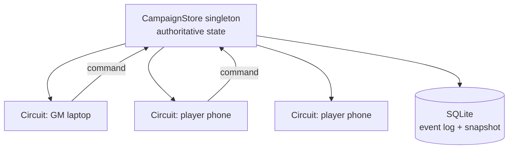

# Engineering notes

2026-09-18 · Target framework: .NET 10 (LTS)

The technical half of the PF2e Table Companion: hosting model, realtime, connection handling on phones, authorization, persistence and the small features that decide whether it survives contact with a real table.

## Hosting model

Blazor Web App on .NET 10 with the Interactive Server render mode, one project, no separate client. .NET 10 shipped on 11 November 2025 with 36 months of long-term support, through November 2028, which outlasts this campaign.

The deciding argument is the monster-privacy rule. In WebAssembly the whole component and its data live in the player's browser, so anything the client renders, the client has. Interactive Server keeps the component tree and its data on the server and sends only rendered diffs down the wire. A player's device never holds the ogre's HP, because it was never sent.

That also removes work: no API layer between the UI and the rules engine, no DTO mapping, no client-side duplicate of the modifier calculator, no CORS, no token refresh in the browser. Six players is not a scale problem — one small server handles this trivially.

What Interactive Server costs, and it is not nothing:

- Every tap is a round trip. On table wifi that is fine; on bad hotel wifi it is visibly laggy.
- No offline. If the server is unreachable the app is unusable, unlike a WebAssembly app with cached rules data.
- A dropped connection has real consequences, which the connection section below deals with at length.

Interactive Auto is the wrong choice here: it would run the same components in WebAssembly after the first load, which puts the data back in the player's browser and breaks the privacy model. If offline ever matters more than privacy, the split is a WebAssembly client for the player's own sheet and rules reference, with the encounter state still server-rendered.

## State: one owner, dumb circuits

The single most important decision in this build: table state lives in one process-wide object per campaign, and a circuit holds nothing but a reference to it. Every reconnect problem below becomes survivable because of this.



The shape:

- `CampaignStore` is a singleton service holding a dictionary of campaign id to `CampaignState`. Six players and one GM means one entry, a few hundred kilobytes.
- Circuits subscribe to a change event on load and unsubscribe on dispose. A component holds no copy of the encounter, only the selection and scroll position it can afford to lose.
- Commands go one way: a component calls `store.Apply(new ApplyCondition(...), actor)`. The store authorizes, validates, mutates, appends to the log, and raises one change event.
- A dropped and restored circuit re-subscribes and re-renders from the store. Nothing is recovered, because nothing was lost.

Two things that will bite if ignored:

- Mutating the state from a background timer (the duration clock, an auto-save) runs off Blazor's synchronization context. Every component that re-renders in response must wrap the call in `ComponentBase.InvokeAsync`, or it throws InvalidOperationException: the current thread is not associated with the Dispatcher. That is a framework rule, not a style preference.
- `InvokeAsync(StateHasChanged)` hides the exception but not the race: it still updates component state from a thread Blazor does not manage. The fix is that components never mutate shared state directly — only the store does, under its own lock, and components render a snapshot handed to them.

So: the store serialises all writes (a plain `lock` or a `SemaphoreSlim` is enough at this scale), produces an immutable snapshot per change, and raises the event; each circuit marshals the render onto its own dispatcher.

Blazor's own circuit state persistence, with `[PersistentState]` on component properties, is deliberately not used for table state. It is designed for high-value state a user expended effort to create, and would give six clients six divergent copies of the encounter. Table state belongs to the campaign, not to a session.

## Realtime: you probably should not write a hub

The non-obvious finding. Interactive Server already runs on SignalR: every circuit is a WebSocket connection the framework manages. A singleton store plus a C# event gets a change onto all six screens with no hub, no client method names, no serialisation contract, no reconnect logic of your own. Writing a `CampaignHub` on top of that is a second realtime system doing what the first already does.

Write a hub only when something that is not a Blazor circuit needs the state: a MAUI app, a WebAssembly client, an OBS overlay for streaming the session, a Discord bot. If any of those are likely, put the store behind an interface now so a hub can be added later without touching the rules engine.

To be unambiguous, since this is the whole point of the app: no hub does not mean no realtime. Interactive Server pushes UI changes over SignalR by design — it is the transport the framework already holds open to every connected device. Skipping a custom hub means not writing a *second* realtime system, not giving up live updates.

### The buff pipeline, end to end

What happens when the fighter taps Raise a Shield, in order:

1. The tap travels over that player's existing circuit connection to the server.
2. The component calls `store.Apply(new RaiseShield(characterId), actor)`.
3. The store authorizes it (does this account own that character), reads the equipped shield's bonus, and appends a circumstance modifier effect with a timing rule of "start of the affected creature's next turn".
4. The store takes the lock, mutates, appends a log row, builds a new immutable snapshot, releases the lock, and raises `Changed`.
5. Every subscribed circuit — the GM's and five other players' — receives the snapshot, projects it for its own viewer, and marshals a re-render onto its own dispatcher with `InvokeAsync`.
6. Each device receives a rendered diff: only the AC number and the effect chip change, a few hundred bytes.

No polling, no refresh, no "tell the GM". The GM's screen updates because the state it renders changed, not because anyone sent it a message.

### Latency budget

| Hop | Cost on table wifi |
| --- | --- |
| Tap to server | 5–30 ms |
| Authorize, mutate, snapshot | well under 1 ms at this data size |
| Projection and render diff, per viewer | ~1 ms |
| Server to each device | 5–30 ms |

Call it under 100 ms from tap to the GM seeing it, which reads as instant. Two things can ruin that, and both are worth checking on day one: a proxy that downgrades WebSockets to long polling, and a phone on mobile data instead of the room's wifi.

### Keeping it feeling instant

- Rebuild one snapshot per change and hand the same instance to every subscriber; do not recompute state per viewer. Only the projection is per-viewer, and it is a cheap filter.
- Debounce nothing on the way out. A buff landing 200 ms later to save a render is a worse trade than the render.
- Batch a multi-target effect (Courageous Anthem on six PCs) into one command and one snapshot, not six. Six separate events means six renders on seven devices.
- Animate the change on arrival — the AC number flashing once as it goes 20 → 22 — so the GM notices it without watching for it. This is the one place motion earns its keep.
- The snapshot write to SQLite is debounced and happens after the event is raised, so persistence never sits between the tap and the screen.

### If a hub does get added

| Concern | What to do |
| --- | --- |
| Sending to one person | Implement `IUserIdProvider` and register it, then `Clients.User(id)`; one user may have several connections (phone and laptop) and all of them receive it |
| Splitting GM traffic from player traffic | Two groups per campaign, `campaign:{id}` and `campaign:{id}:gm` |
| Treating those groups as the security boundary | Don't. Groups are kept in memory and are not a security feature; authentication claims have expiry and revocation that groups don't, and a revoked member must be removed explicitly. Authorize every call and filter the payload |
| Hub state | Never store state in a hub class — each hub method call runs on a new hub instance; the store is the state |
| Pushing from elsewhere | `IHubContext<CampaignHub>` from the duration clock or a background service |

### Projections

One authoritative state, two rendered views. The projection is a pure function: `Project(CampaignState, viewer) -> ViewerState`, which strips unrevealed monsters, replaces private numbers with nothing at all, and marks what the viewer may edit.

With no hub, the projection runs during render on the server, so a player's markup is built from their projection and the private fields never leave the process. With a hub, the projection runs before the send, per group or per user. Either way it is the same function, and it is the one thing in the codebase that deserves exhaustive tests.

### Ordering and conflicts

Six people tapping at once is real: two players both apply a buff, the GM advances the turn mid-tap.

- All commands funnel through the store's lock, so they apply in arrival order and the state is never half-updated.
- Commands are intent, not diffs: "apply Courageous Anthem to these six" rather than "set attack to +13". Two intents merge; two diffs fight.
- Attach the round and turn index to any command whose meaning depends on them. Advancing the turn while a player's damage is in flight should apply the damage, not reject it, but the log should record which turn it landed in.
- Last-write-wins is acceptable for HP and current selection. It is not acceptable for "next turn", which must be idempotent per round-and-index so a double tap does not skip a player.

### Undo

Every command appends an entry to an in-memory log with the actor, the timestamp and the inverse. Undo pops the last entry and applies its inverse; the GM gets undo, players do not. A cap of a hundred entries per encounter keeps memory flat, and the log doubles as the session recap: "round 3: Zuz cast Courageous Anthem, ogre hit Rune for 12".

## Connection reality on phones

Six phones on a table spend most of the session locked in someone's pocket or face-down beside the dice. This is the failure mode that kills Blazor Server apps on mobile, and it has to be designed for rather than discovered.

What happens when a player locks their phone: the OS backgrounds the page, the WebSocket dies, and the circuit is disconnected. Come back a few minutes later and the classic outcome is the "could not reconnect to the server, reload the page" banner. This is long-standing and well documented, not a bug to wait out — browsers close connections aggressively on mobile to save battery, and a lock screen or inactive tab will often close it.

.NET 10 changed the picture. Three mechanisms now stack, and they solve different parts of it.

| Mechanism | What it does | Default | Use it here? |
| --- | --- | --- | --- |
| Automatic reconnect | Client retries the circuit; if the server already released it, the page refreshes itself | On | Yes, with a visible banner |
| Stateful reconnect | Available since .NET 8; buffers messages on both sides across a short drop and delivers them on reconnect, opt in at both the hub endpoint and the client, default buffer 100,000 bytes | Off | Yes for a custom hub; covers wobbly wifi, not a locked phone |
| Circuit state persistence | Serialises `[PersistentState]` properties so a session survives a long disconnect or a pause | On by default with `AddInteractiveServerComponents`, MemoryCache, up to 1,000 circuits for two hours, both configurable | Barely needed — see below |

### Why this design mostly sidesteps it

Because the store owns the state and the circuit owns nothing, a lost circuit costs a re-render, not data. The reconnect path can be blunt: try to reconnect, and if the circuit is gone, reload the page, re-authenticate from the cookie, re-subscribe, and re-render current state. The player sees a flash and their turn is still there.

The cost of this being wrong is worth stating plainly: if state had lived in components, every locked phone would lose a character's in-progress turn, and the group would abandon the app within two sessions.

What still needs `[PersistentState]` is only what is genuinely per-viewer and unsaved: an open dialog, a half-typed damage number, the selected combatant. Persist those, and note the conditions — a page refresh loses the persisted state, it must be JSON serializable, and recovery is never guaranteed.

### Auto-pause, and its mobile caveat

.NET 10 ships an opt-in `Microsoft.AspNetCore.Components.Server.AutoPause` package that pauses a circuit when the browser tab becomes hidden, freeing server memory and SignalR connections, with a `HiddenDelay` that defaults to two minutes. Tempting for six phones that are hidden most of the time.

Read the caveat before relying on it. On mobile the page also becomes hidden when the whole app is backgrounded, and the OS suspends the page's JavaScript within seconds on Android and up to about thirty seconds on iOS; if `HiddenDelay` is longer than that window the pause timer never fires and the circuit is dropped by the OS instead of pausing gracefully. Graceful auto-pause is explicitly not a supported scenario on mobile when the app is backgrounded.

So: enable auto-pause if server memory ever matters, with a `HiddenDelay` of a few seconds rather than two minutes, and treat it as an optimisation that will often not run. Do not build behaviour on top of it. Manual `Blazor.pauseCircuit()` and `Blazor.resumeCircuit()` on `visibilitychange` are available if a more deliberate policy is wanted.

### Settings worth setting

- Raise `ClientTimeoutInterval` and lower `KeepAliveInterval` (60 s and 15 s are reasonable) so brief wifi hiccups do not tear down a circuit.
- Give the reconnect UI honest copy: "Reconnecting — your turn is saved" beats the default banner, and it is true in this design.
- Show a small connection dot per player on the GM screen. The GM knowing that Rune's phone is asleep is worth more than any automatic recovery.
- Test the actual case before building further: open the app on an iPhone, lock it, wait five minutes, unlock. That one test tells you more than any amount of configuration.

## Authorization in practice

The policy table in the design document has to become code that runs on every command, not attributes on pages.

### Shape

- Cookie authentication with external providers (Discord, Google) plus an email link. The cookie is what a reconnecting circuit re-authenticates with, so its lifetime should comfortably outlast a session: sliding expiry, thirty days.
- Claims are small and stable: account id, display name. Campaign membership and character ownership are read from the database, not baked into the cookie, so the GM removing someone takes effect immediately rather than at next sign-in.
- A `CampaignContext` scoped service resolves the current member once per circuit: campaign id, role, owned character ids. Every component and every command reads from it.

### Where the check lives

Authorize inside the store, at the command boundary. A check in a component is a UI affordance; a check in the store is the rule. `Apply(command, actor)` asks one question — may this actor issue this command against this target — and throws if not.

```csharp
// sketch, not final
public Result Apply(ICampaignCommand cmd, Actor actor)
{
    var decision = _policy.Evaluate(cmd, actor, _state);
    if (!decision.Allowed) return Result.Denied(decision.Reason);
    lock (_gate) { /* mutate, append to log, snapshot */ }
    Changed?.Invoke(_snapshot);
    return Result.Ok;
}
```

ASP.NET Core's policy-based authorization fits for page-level gates (`CampaignGm`, `CampaignMember`) with resource-based checks (`AuthorizeAsync(user, character, "EditCharacter")`) for the per-object ones. The framework machinery is worth using for pages; the command path is better served by a single explicit policy object that is trivially unit-testable against the table from the design document.

### Guest links

A one-time join link is a signed token carrying campaign id, character id, an expiry and a nonce. Redeeming it creates a short-lived cookie with the same shape as a member's, scoped to one character, and marks the nonce used. Guests get player rights over exactly that character and nothing else. Expire them at the end of the session by default — a link that works forever is a link that leaks.

### Two things not to do

- Don't use SignalR groups or client-side render conditions as the privacy boundary. The projection is the boundary; groups are routing.
- Don't send the full state and hide parts in the UI. On Interactive Server this is easy to get wrong by accident: a component that receives the full `CampaignState` and renders a subset still had the data on the server, which is fine, but the moment anything is passed to JavaScript interop or a WebAssembly island, it is on the device. Pass projections down, never the root state.

## Persistence

SQLite with EF Core. One file, no server to run, trivially backed up by copying it, and correct for a database that will never exceed a few megabytes. Postgres is the answer to a scale problem this project does not have.

### What is stored how

| Data | Storage | Why |
| --- | --- | --- |
| Accounts, campaigns, memberships, characters, monsters | Relational tables | Queried, joined, and edited outside a session |
| Rules data (conditions, activities, feats, effects) | JSON files shipped with the app, plus a table for campaign overrides and house rules | Version-controlled, diffable, reviewable; a wrong condition is fixed by a commit |
| Live encounter state | In memory, snapshotted to a single JSON column on change | Written constantly; nothing gains from being normalised |
| Command log | Append-only table, one row per command with actor, timestamp and payload | Undo, session recap, and the only way to debug "the app said I had 4 HP" |

### Snapshot cadence

Write the encounter snapshot on a debounce — a second or two after the last change — rather than on every tap. The log row is written immediately, because it is the record; the snapshot is an optimisation so a restart does not have to replay.

On startup, load the snapshot, replay any log rows newer than it, and the campaign is exactly where it was. A crash mid-session costs nothing.

### Migrations

EF Core migrations, applied at startup for a single-instance app of this size. Rules data is not in migrations: it is files, loaded and validated at boot, and a load failure should refuse to start rather than run with half a ruleset.

### Serialisation

System.Text.Json with source generation. Effects and commands are polymorphic, so either a type discriminator per record or `[JsonDerivedType]` on the base — decide once, early, because retrofitting a discriminator onto a log with thousands of rows is the kind of chore that kills a side project.

## The niceties

Small features, disproportionate effect on whether the thing gets used a third time.

### Keep the screen awake

The single best quality-of-life feature for a table app. A phone that dims every thirty seconds during someone else's turn is a phone that gets put down. The Screen Wake Lock API holds the screen on while the tab is visible, and it is Baseline newly available since 31 March 2025, supported in Chrome 84, Firefox 126, Safari 16.4 and Safari on iOS 18.4.

Three practical notes: it needs HTTPS, the lock is released automatically when the page is hidden so it must be re-acquired on `visibilitychange`, and a request can be refused for reasons like power-save mode or low battery. Offer it as a toggle per device, on by default during an encounter, released in Downtime.

### Installable, not offline

A web app manifest and an icon give "add to home screen", full-screen chrome and a proper app icon on the table. That is worth having. Do not promise offline: Interactive Server cannot work without the server, and a service worker that caches the shell only makes the failure more confusing. The honest offline story is a printed condition card.

### Input on a phone, under time pressure

- Damage and healing through a number pad with `inputmode="numeric"`, plus `+`/`-` steppers and a running total, so 12 slashing minus resistance is entered once.
- Every tap target at least 44 px, and the destructive ones (kill, remove combatant) behind a long press or a confirm, because a mis-tap during a fight is worse than a slow tap.
- A short vibration on "your turn" via the Vibration API, which Safari on iOS does not support. Treat it as a bonus on Android and rely on the visual turn banner everywhere.
- The GM's laptop deserves keyboard shortcuts: space for next turn, `d` for damage on the selected combatant, `c` for conditions, `u` for undo, `/` for search. This is where the GM's speed actually comes from.

### Layouts

Three, not one: the GM on a laptop (initiative list plus detail pane side by side), a player on a phone (own character first, party strip, encounter order below), and a shared screen if the table has a TV (initiative order and conditions only, enormous type, no interaction). The shared screen is a read-only projection with its own guest token — the cheapest way to make the tracker visible to everyone at once.

### Language

The group plays in Danish and the rules are in English. Do not translate rule text; keep the Pathfinder terms as printed so what is on screen matches what the GM says. Localise only the app's own chrome, and only if anyone actually wants it — a Danish UI wrapped around English condition names is a reasonable place to land.

### Rules data as code

Rules records live in the repo as JSON and are validated at boot: unknown modifier targets, durations with no timing rule, and activities referencing missing feats all fail the build rather than surfacing mid-fight. A small test project asserts the worked examples from the design document — Courageous Anthem plus sickened 2 nets −1, frightened decrements at end of turn — so the engine cannot silently regress.

### Diagnostics for the GM, not just the developer

A per-combatant "why this number" panel showing base, proficiency, attribute and each active modifier by name. It is the debugging tool and the trust-building feature at once: when the GM disagrees with the app, the panel settles it in five seconds, and if the app is wrong, the panel says which record to fix.

## Operations

One container, one volume, one hostname. Anything more elaborate is a second hobby.

- Host: a small VPS or a home machine behind a tunnel. Both work; the home machine only works if game night never happens somewhere else.
- HTTPS is not optional — wake lock, service workers and secure cookies all require it. A free certificate via the host's reverse proxy is enough.
- WebSockets must be enabled end to end. A proxy that downgrades to long polling turns a snappy tracker into a laggy one, and it is the first thing to check when "it feels slow".
- Deploy between sessions, never during one. .NET 10 can request a graceful circuit pause on shutdown so clients preserve state across a restart, but the simpler policy for a group of seven is: do not deploy on a Tuesday evening.
- Backup: copy the SQLite file nightly and before every deploy, keep a week. The campaign state is small and irreplaceable.
- Logging: structured, with campaign id and actor on every command. One log line per applied command is both the audit trail and the bug report.
- Health: an endpoint that checks the database opens and the rules data loaded, so "is it up?" is answerable from a phone before people arrive.

## Testing

This is a side project, so test the parts where being wrong is expensive and skip the rest without guilt.

| Worth testing | Why | How |
| --- | --- | --- |
| Modifier calculator | A wrong number is invisible and poisons trust | Plain xUnit over the stacking rules, one test per case in the design document's table |
| Duration clock | Off-by-one on "end of your turn" is the classic bug | xUnit over a scripted round sequence |
| Projection function | A leak here shows players monster HP | xUnit: assert the player projection contains no private field, for every combatant kind and reveal state |
| Command authorization | The policy table is the security model | xUnit, table-driven straight from the design document's policy table |
| Rules data validation | Catches a typo before a session, not during one | A test that loads every shipped record and asserts it resolves |

Not worth it: component rendering for most screens, end-to-end browser tests, anything mocking SignalR. bUnit earns its place for the two or three components with real logic — the initiative list ordering, the condition chip with its value and countdown — and nowhere else.

The test that matters most is not automated: run a real fight on the app with the GM present before building phase 3. Everything in this document is a hypothesis until then.

## Sources

Pages opened for this section, checked 18 September 2026.

- [ASP.NET Core Blazor server-side state management](https://learn.microsoft.com/en-us/aspnet/core/blazor/state-management/server?view=aspnetcore-10.0) — circuit state persistence defaults, `[PersistentState]`, pause and resume, the auto-pause package and its mobile caveat
- [ASP.NET Core SignalR configuration](https://learn.microsoft.com/en-us/aspnet/core/signalr/configuration?view=aspnetcore-8.0) — stateful reconnect, buffer size, opting in on both ends
- [Authentication and authorization in ASP.NET Core SignalR](https://learn.microsoft.com/en-us/aspnet/core/signalr/authn-and-authz?view=aspnetcore-10.0) — `IUserIdProvider`, `HubInvocationContext` as an authorization resource
- [Manage users and groups in SignalR](https://learn.microsoft.com/en-us/aspnet/core/signalr/groups?view=aspnetcore-10.0) — groups are in-memory routing, not a security feature
- [Use hubs in ASP.NET Core SignalR](https://learn.microsoft.com/en-us/aspnet/core/signalr/hubs?view=aspnetcore-10.0) — hub instance lifetime, `IHubContext`
- [ASP.NET Core Blazor state management overview](https://learn.microsoft.com/en-us/aspnet/core/blazor/state-management/?view=aspnetcore-10.0) — state modifications from outside the synchronization context
- [Blazor University: thread safety using InvokeAsync](https://blazor-university.com/components/multi-threaded-rendering/invokeasync/) — the dispatcher rule, and why `InvokeAsync(StateHasChanged)` hides races rather than fixing them
- [Screen Wake Lock](https://web-platform-dx.github.io/web-features-explorer/features/screen-wake-lock/) and [MDN: Screen Wake Lock API](https://developer.mozilla.org/docs/Web/API/Screen_Wake_Lock_API) — baseline status, per-browser versions, release behaviour
- [Blazor Reconnection Issue After Locking Smartphone](https://learn.microsoft.com/en-us/answers/questions/1300629/blazor-reconnection-issue-after-locking-smartphone) — the mobile disconnect behaviour as experienced in the field
- [.NET 10.0 is Ready](https://www.heise.de/en/news/NET-10-0-is-Ready-11075047.html?seite=all) — release date and the 36-month support window

Pathfinder rules figures elsewhere in this project are from memory and still need checking against the books; nothing on this tab depends on them.
